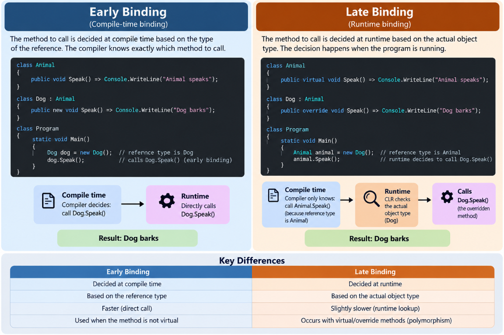

# Binding in C#



```csharp
Animal animal = new Dog();
^^^^^^^          ^^^^^
reference        actual object
type             type
```
# Early Binding
The method is decided at compile time based on the reference type.

# Late Binding
The method is decided at runtime based on the actual object type.

Late binding happens with virtual and override.

# Dynamic Dispatch
Dynamic dispatch is the runtime process that determines which overridden method should be called based on the actual object type.

# Example
```
Animal animal = new Dog();

animal.Speak();

Early Binding → compile time → reference type
Late Binding → runtime → actual object type
Dynamic Dispatch → runtime process → selects the correct overridden method
Important
C# methods are not virtual by default.

To allow a method to be overridden, the base method must be declared with virtual, abstract, or already be an override.
```